

# SE-Assignment-5
Installation and Navigation of Visual Studio Code (VS Code)
 Instructions:
Answer the following questions based on your understanding of the installation and navigation of Visual Studio Code (VS Code). Provide detailed explanations and examples where appropriate.

Questions:

1. Installation of VS Code:
   - Describe the steps to download and install Visual Studio Code on Windows 11 operating system. Include any prerequisites that might be needed.
   prerequisites
      - Ensure your Windows 11 system meets the minimum system requirements:
      - 64-bit processor
      - Windows 10 (64-bit) version 1903 or later
      - 1 GB of RAM
      - 1.5 GB of available hard disk space
      - Visit the Visual Studio Code website (https://code.visualstudio.com/) and click on the "Download" button at top right corner. 
      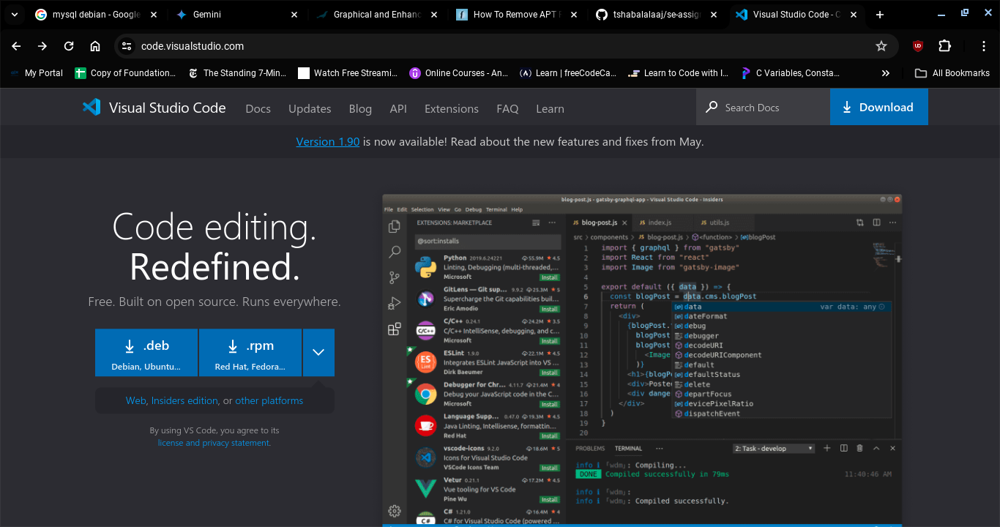
      click on the "Download for Windows" button.
      
      - Download the appropriate installer file for your operating system.
      - Double-click on the downloaded file to open it.
      - Run the downloaded installer file and follow the on-screen instructions.
      - Select the installation location and click on "Install".
      - Once the installation is complete, click on "Launch" to open Visual Studio Code.
      - The Visual Studio Code installation should be successful.

2. First-time Setup:
   - After installing VS Code, what initial configurations and settings should be adjusted for an optimal coding environment? Mention any important settings or extensions.

      - Settings:
         - Open "Settings" (Ctrl + ,).
         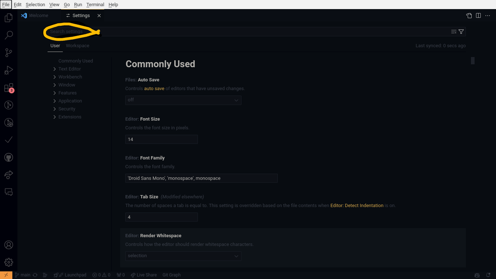

         - Font Settings:
            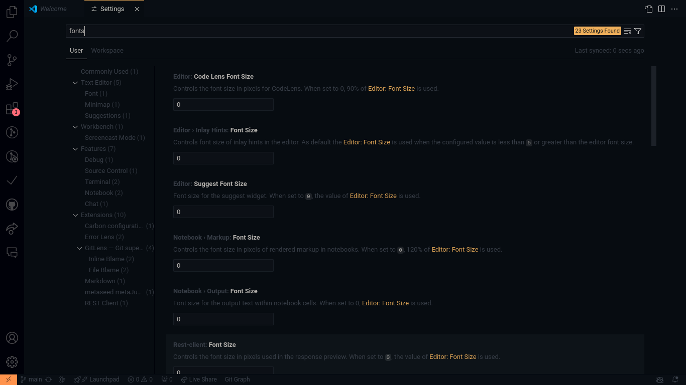
            - Search for "Font Family" and select a font that is easy to read.
            - Adjust the "Font Size" to your preference.
            - Enable "Ligatures" for improved code readability.
            
         - Theme Settings:
            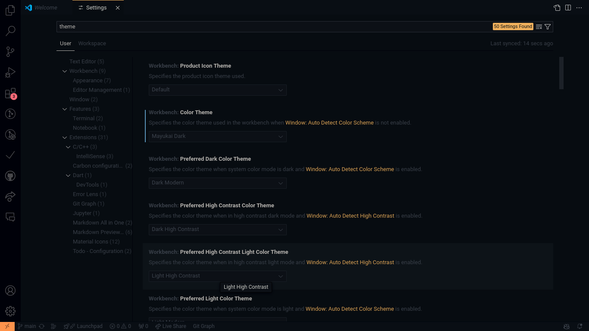
            - Search for "Color Theme" and select a theme that suits your preferences.
            - Adjust the "Contrast" and "Opacity" settings to improve visibility.

         - Keyboard Shortcuts:
            - Access the "Keyboard Shortcuts" section using ctrl + k ctrl + s.
            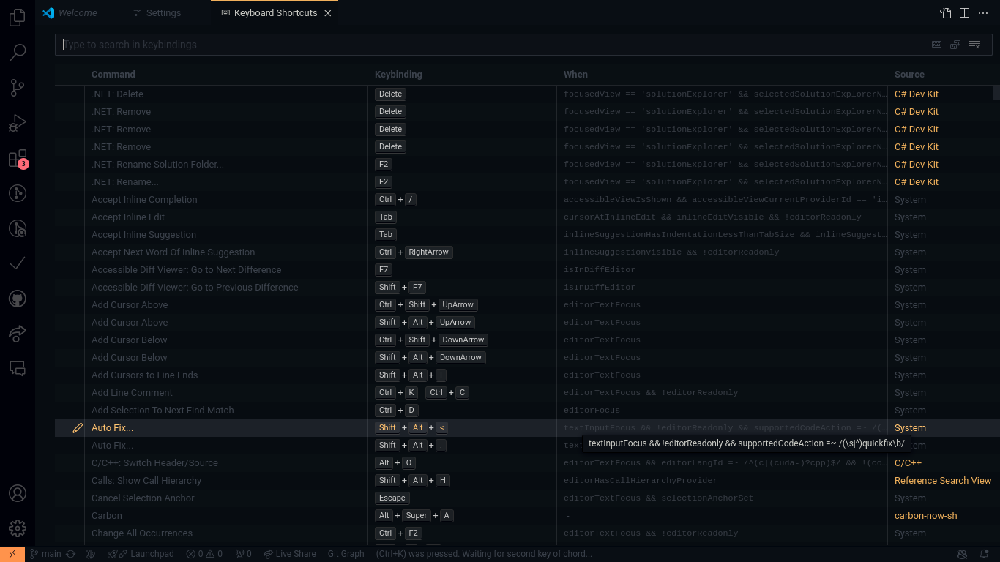
            - Search for "Keyboard Shortcuts" and customize shortcuts for frequently used commands.
            - For example, assign "Ctrl + S" to save files.
         
      - Install Essential Extensions:
      - Open the "Extensions" tab (Ctrl + Shift + X).
      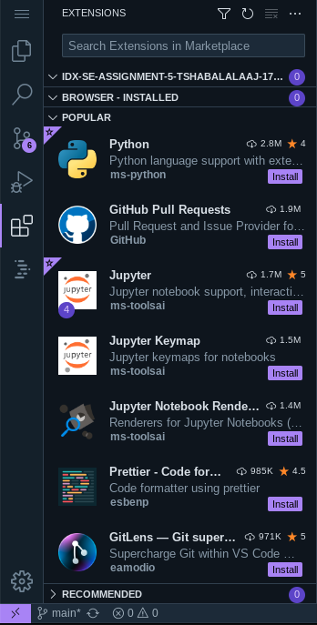
      - Search for and install extensions like:
         - Web Development:
            - ESLint
            - Prettier
            - Live Server
         - Flutter:
            - Flutter
            - Dart
            - Flutter Intl
         - Python:
            - Python
            - Pylance
            - Jupyter
         - SQL:
            - SQL Tools
            - mssql
            - pgAdmin
         - Git:
            - GitLens
            - GitHub Pull Requests and Issues
            - Git History
         - Database Development:
            - MySQL
            - PostgreSQL
            - MongoDB

3. User Interface Overview:
   - Explain the main components of the VS Code user interface. Identify and describe the purpose of the Activity Bar, Side Bar, Editor Group, and Status Bar.
      - Activity Bar:
         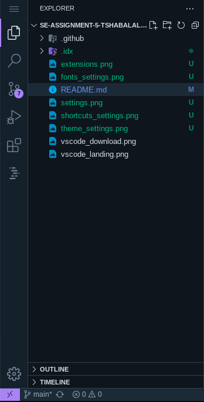
         - Located on the left side of the window.
         - Provides access to common tasks like opening files, searching, and debugging.
      - Side Bar:
         
         - Located on the left side of the window, below the Activity Bar.
         - Displays the current project structure, including files and folders.
      - Editor Group:
         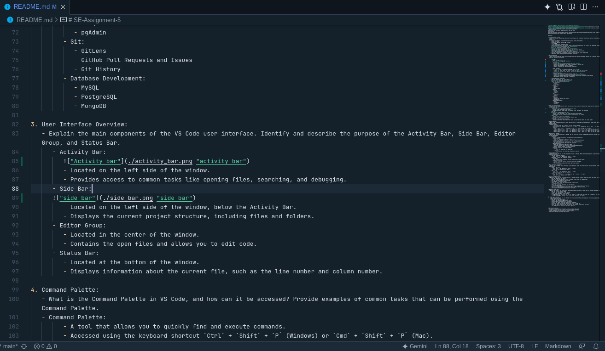
         - Located in the center of the window.
         - Contains the open files and allows you to edit code.
      - Status Bar:
         
         - Located at the bottom of the window.
         - Displays information about the current file, such as the line number and column number.

4. Command Palette:
   - What is the Command Palette in VS Code, and how can it be accessed? Provide examples of common tasks that can be performed using the Command Palette.
   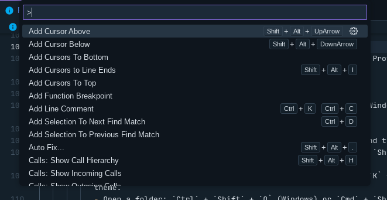
   - Command Palette:
         - A tool that allows you to quickly find and execute commands.
         - Accessed using the keyboard shortcut `Ctrl` + `Shift` + `P` (Windows) or `Cmd` + `Shift` + `P` (Mac).
         - Examples:
            - Open a file: `Ctrl` + `P` (Windows) or `Cmd` + `P` (Mac) and type the file name.
            - Find a symbol: `Ctrl` + `Shift` + `O` (Windows) or `Cmd` + `Shift` + `O` (Mac) and type the symbol name.
            - Change the theme: `Ctrl` + `K` + `T` (Windows) or `Cmd` + `K` + `T` (Mac) and select a theme.
            - Open a folder: `Ctrl` + `Shift` + `O` (Windows) or `Cmd` + `Shift` + `O` (Mac) and type the folder name.
            - Run a command: `Ctrl` + `Shift` + `R` (Windows) or `Cmd` + `Shift` + `R` (Mac) and type the command name.

5. Extensions in VS Code:
   - Discuss the role of extensions in VS Code. How can users find, install, and manage extensions? Provide examples of essential extensions for web development.
   
      - Extensions:
         - Enhance VS Code functionality with additional features and tools.
         - Find extensions:
            - Open the "Extensions" tab (Ctrl + Shift + X).
            - Browse the featured extensions or search for specific extensions.
         - Install extensions:
            - Click on the "Install" button next to the desired extension.
            - VS Code will download and install the extension.
         - Manage extensions:
            - Open the "Extensions" tab (Ctrl + Shift + X).
            - Click on the gear icon to access extension management options.
            - Enable, disable, update, or remove extensions.
         - Essential extensions for web development:
            - ESLint:
               - Linter for JavaScript and TypeScript.
            - Prettier:
               - Code formatter for JavaScript, TypeScript, and CSS.

6. Integrated Terminal:
   - Describe how to open and use the integrated terminal in VS Code. What are the advantages of using the integrated terminal compared to an external terminal?
   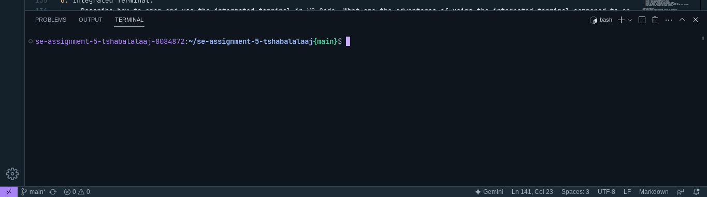
      - Open the integrated terminal:
         - Press `Ctrl` + `\` (Windows) or `Cmd` + `\` (Mac).
      - Advantages of using the integrated terminal:
         - Convenient:
            - No need to switch between VS Code and an external terminal window.
         - Seamless integration:
            - Access to VS Code features like IntelliSense and debugging.
         - Cross-platform:
            - Works consistently across different operating systems.

7. File and Folder Management:
   - Explain how to create, open, and manage files and folders in VS Code. How can users navigate between different files and directories efficiently?
      - Create a new file:
         - Press `Ctrl` + `N` (Windows) or `Cmd` + `N` (Mac).
         - Enter the file name and press `Enter`.
      - Open a file:
         - Press `Ctrl` + `O` (Windows) or `Cmd` + `O` (Mac).
         - Select the file from the file explorer.
      - Create a new folder:
         - Press `Ctrl` + `Shift` + `N` (Windows) or `Cmd` + `Shift` + `N` (Mac).
         - Enter the folder name and press `Enter

8. Settings and Preferences:
   - Where can users find and customize settings in VS Code? Provide examples of how to change the theme, font size, and keybindings.
   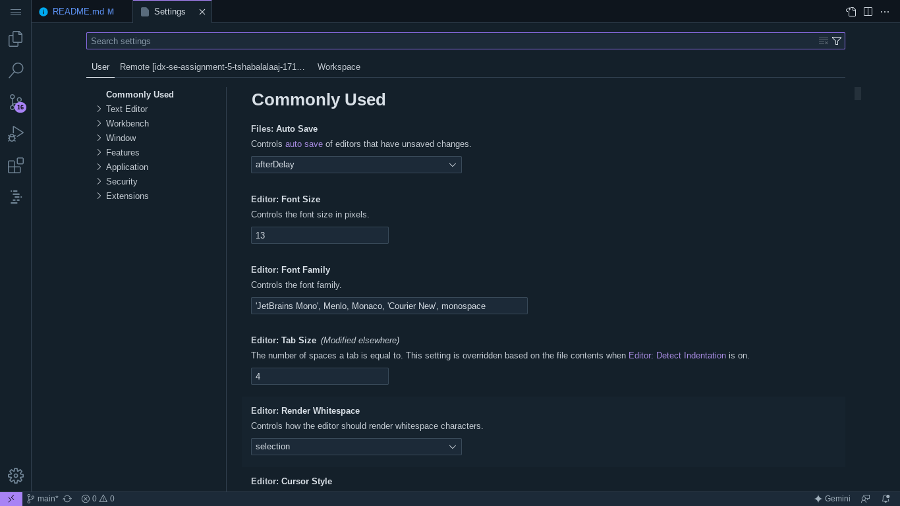
      - Open the "Settings" tab (Ctrl + ,).
      - Search for the desired setting, such as "Theme", "Font Size", or "Keybindings".
      - Make the desired changes to the settings.
      - For example, to change the theme:
      - Search for "Color Theme" and select a theme from the list.
      - To change the font size:
      - Search for "Font Size" and enter the desired size.
      - To change keybindings:
      - Search for "Keyboard Shortcuts" and click on the "Open Keyboard Shortcuts" button.
      - Find the desired command and click on the "Edit Keyboard Shortcut" button.
      - Enter the new keyboard shortcut and click on "Save".

9. Debugging in VS Code:
   - Outline the steps to set up and start debugging a simple program in VS Code. What are some key debugging features available in VS Code?
      - Open the file you want to debug.
      - Click on the "Run" button in the toolbar.
      - Select "Start Debugging" from the menu.
      - A debugging session will start and you will be able to step through your code, set breakpoints, and inspect variables.
      - To stop the debugging session, click on the "Stop" button in the toolbar.

10. Using Source Control:
      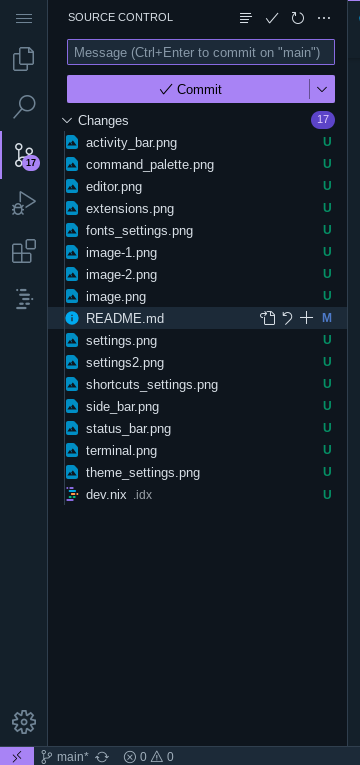
    - How can users integrate Git with VS Code for version control? Describe the process of initializing a repository, making commits, and pushing changes to GitHub.
      - Open the Git tab (Ctrl + Shift + G).
      - Click on the "Initialize Repository" button.
      - Enter a commit message and click on "Commit".
      - Click on the "Push" button and select "Push to GitHub".
      - Enter your GitHub username and password and click on "Sign in".
      - Select the remote repository you want to push your changes to and click on "Push".
      - The changes will be pushed to the remote repository.

